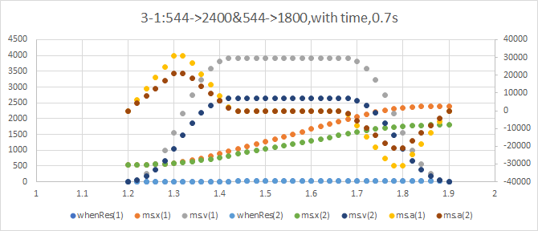
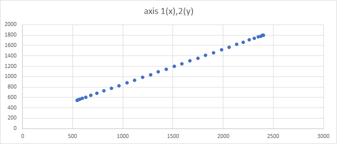

# MotionPath
## 時間拘束型S字加減速運動軌跡<br>Time-constrained S-curve motion path

MothionPathは、指定した位置に、指定した **時間** で、ジャークが考慮されたS字加減速を行いながら到達する、「軌跡」を計算するライブラリです。<br>
移動距離の違う複数の軸に対し、適切な時間を指定することにより、複数の軸を同期して動作させることができます。

## 適用例
軸1をx、軸2をyに見立て、xを544->2400まで、yを544->1800まで、両軸ともに0.7secで移動させた例です。<br>



対応するコードは
```c
void MotionPath_UnitTest(void)
```
を参照してください。

## 注意点
加減速時間を消費しきれないような場合(移動距離が短いとか、時間が長くて速度が出ないとか)の問題は解決できていません。今後の課題とします。

